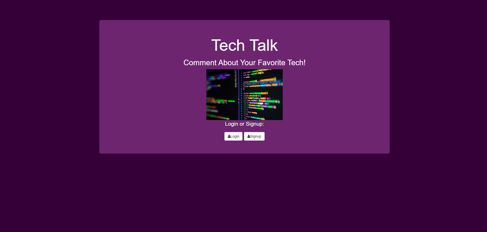

# TECH TALK

Link to project: ()

## How It's Made:
Tech used: EJS, CSS, JS, Node.js, passport, MongoDB

Tech Talk is a web application that lets users log in, share posts about their favorite technologies, and engage with others. User authentication is managed via Passport.js, with login and signup routes secured for individual accounts. MongoDB serves as the database for storing user messages and their corresponding likes. EJS powers the dynamic front-end rendering, providing personalized user experiences based on login state and profile details.

## Optimizations

- Enabled secure user authentication with Passport.js, including functionality for login, signup, and account unlinking.
- Created real-time interactive message functionality, allowing users to like, dislike, or delete posts, with immediate updates to the database and front-end.
- Improved database operations by using upsert for efficient updates, minimizing redundant queries when liking or disliking messages.

## Lessons Learned

- Gained a deeper understanding of implementing and securing user authentication systems with Passport.js, including the management of flash messages for feedback.
- Learned how to seamlessly integrate back-end data with dynamic EJS templates for personalized user profiles and message boards.
- Discovered the importance of modular route handling to maintain a clean and scalable codebase for multi-functional applications.

## Installation

1. Clone repo
2. run `npm install`

## Usage

1. run `node server.js`
2. Navigate to `localhost:8080`

## Credit

Modified from Scotch.io's auth tutorial
